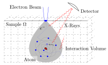

# m1epma: A finite volume solver of the M1model based on CLAWPACK for Reconstruction in EPMA

[](https://zenodo.org/badge/latestdoi/364845684)




[EPMA (Electron Probe Microanalysis)](https://en.wikipedia.org/wiki/Electron_microprobe) is a non-destructive method to determine the chemical composition of a material sample.
An electron beam bombards the sample, which subsequently emits detectable x-radiation.
From measured x-ray intensities, the chemical composition is reconstructed.

This software implements the reconstruction as a minimization problem, where k-ratios (normalized x-ray intensities) simulated by a model are fitted to experimental data.
To simulate the electron transport inside the sample we use the M1-model in BCSD approximation, the k-ratios are calculated using an integral formula, considering ionization cross-section, fluorescence yield, and the attenuation in the material.

This software can compute jacobians alongside the k-ratios to allow the implementation of gradient-based optimization routines.
For the jacobians, we rely on the adjoint state method.

Note that this code is intended for reasearch, hence mostly undocumented.
Some crude documentation (which helped while implementing) is provided under [/doc](doc)

For further information see:
- (TODO) cite paper
- Claus, T. J. (2018). [Application of the Adjoint Method in Gradient-based Optimization to the M1-Model in Electron Beam Microanalysis.](http://www.mathcces.rwth-aachen.de/_media/3teaching/00projects/2018_ba_tammeclaus.pdf)

## Dependencies
- This software uses the following python-packages: ```numpy, numpy-mips64, matplotlib, clawpack, jax, jaxlib```
- To build the custom Riemann solvers using f2py, LAPACK needs to be installed

## Usage
Have a look at [```example.ipynb```](https://nbviewer.jupyter.org/github/tam724/m1epma/blob/main/example.ipynb) to see the software in use.

- to build the Riemann Solvers (using the f2py library)

```python -m numpy.f2py -c rpn2_riemann_solver_forward.f90 -m rpn2_riemann_solver_forward -llapack --opt="-ffree-line-length-none"```

```python -m numpy.f2py -c rpn2_riemann_solver_adjoint.f90 -m rpn2_riemann_solver_adjoint -llapack --opt="-ffree-line-length-none"```

## Contact
Tamme Claus - tamme.claus@rwth-aachen.de

supervised by:
 - [Jonas Bünger](http://www.mathcces.rwth-aachen.de/5people/buenger/start)
 - [Manuel Torrilhon](http://www.mathcces.rwth-aachen.de/5people/torrilhon/start)

## Resources

Mass Attenuation Coefficient Database: https://www.nist.gov/pml/x-ray-mass-attenuation-coefficients

CLAWPACK: https://www.clawpack.org

JAX: https://github.com/google/jax

## License
GNU GPLv3, see [LICENSE](LICENSE)

## References
Bradbury, J., Frostig, R., Hawkins, P., Johnson, M. J., Leary, C., Maclaurin, D., Necula, G., Paszke, A., VanderPlas, J., Wanderman-Milne, S., & Zhang, Q. (2018). JAX: composable transformations of Python+NumPy programs (0.2.5) [Computer software]. http://github.com/google/jax

Bünger, J., Richter, S., & Torrilhon, M. (2018). A deterministic model of electron transport for electron probe microanalysis. IOP Conference Series: Materials Science and Engineering, 304, 012004. https://doi.org/10.1088/1757-899x/304/1/012004

Duclous, R., Dubroca, B., & Frank, M. (2010). A deterministic partial differential equation model for dose calculation in electron radiotherapy. Physics in Medicine and Biology, 55(13), 3843–3857. https://doi.org/10.1088/0031-9155/55/13/018

Larsen, E. W., Miften, M. M., Fraass, B. A., & Bruinvis, I. A. D. (1997). Electron dose calculations using the Method of Moments. Medical Physics, 24(1), 111–125. https://doi.org/10.1118/1.597920

LeVeque, R. J. (2002). Finite Volume Methods for Hyperbolic Problems. Cambridge University Press. https://doi.org/10.1017/CBO9780511791253

Mevenkamp, N., Pinard, P. T., Richter, S., & Torrilhon, M. (2016). On a hyperbolic conservation law of electron transport in solid materials for electron probe microanalysis. Bulletin of the Brazilian Mathematical Society, New Series, 47(2), 575–588. https://doi.org/10.1007/s00574-016-0170-x

Plessix, R.-E. (2006). A review of the adjoint-state method for computing the gradient of a functional with geophysical applications. Geophysical Journal International, 167(2), 495–503. https://doi.org/10.1111/j.1365-246X.2006.02978.x

Reimer, L. (1998). Scanning Electron Microscopy: Physics of Image Formation and Microanalysis (2nd ed.). Springer-Verlag. https://doi.org/10.1007/978-3-540-38967-5

